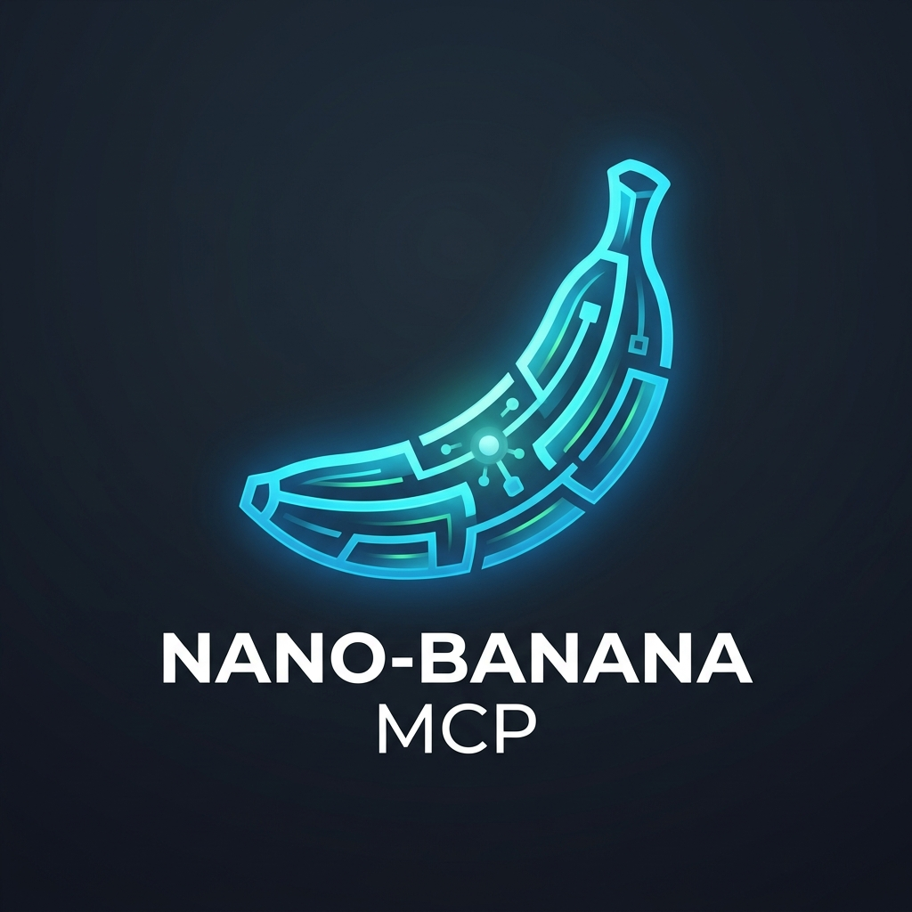

<p align="center">
  
</p>

# Nano-Banana MCP Server v2 🍌

An enhanced Model Context Protocol (MCP) server that provides AI image generation and editing capabilities using Google's Gemini Multimodal Image APIs (`gemini-3.1-flash-image` / `gemini-3-pro-image`).

This is a **v2 fork** of the original `nano-banana-mcp` server, updated to support modern Gemini models, custom model configuration, and direct-from-GitHub installation.

---

## ✨ Features

- 🎨 **Generate Images**: Create new images from text descriptions.
- ✏️ **Edit Images**: Modify existing images using text prompts and optional reference images.
- 🔄 **Iterative Editing**: Refine the last generated or edited image sequentially.
- 🧠 **Dynamic Model Selection**: Specify which model to use via tool parameters, environment variables, or rely on a smart modern fallback.
- 🚀 **Zero-Publish Install**: Install directly from your GitHub repository using standard Git URLs.
- 📁 **Cross-Platform Auto-Saving**: Automatically saves generated images locally under platform-appropriate directories.

---

## 🛠️ Supported Gemini Models

By default, the server uses **`gemini-3.1-flash-image`**, which replaces the deprecated `gemini-2.5-flash-image-preview`.

You can configure or specify:
*   **`gemini-3.1-flash-image`**: Standard efficiency model optimized for speed and high-volume generation.
*   **`gemini-3-pro-image`**: High-fidelity creative model optimized for highly contextual native image creation.

---

## 🔑 Configuration & Environment Variables

The server checks configuration in the following priority:

1.  **Tool Arguments**: Pass `model` explicitly inside tool calls (highest priority).
2.  **Environment Variables**:
    *   `GEMINI_API_KEY`: Your Gemini developer token from [Google AI Studio](https://aistudio.google.com/app/apikey).
    *   `GEMINI_IMAGE_MODEL`: Set a default model server-wide (e.g., `gemini-3-pro-image`).
3.  **Local Configuration**: `.nano-banana-config.json` generated via the `configure_gemini_token` tool.

---

## 🚀 Installation & Client Integration

### Method A: Run From Local Directory (Recommended for Development)
Add this to your MCP settings file (e.g., Cursor, Claude Desktop, or Claude Code config):

```json
{
  "mcpServers": {
    "nano-banana-mcpv2": {
      "command": "node",
      "args": ["/Users/house/Documents/gitlab/nano-banana-mcpv2/dist/index.js"],
      "env": {
        "GEMINI_API_KEY": "your-gemini-api-key-here",
        "GEMINI_IMAGE_MODEL": "gemini-3.1-flash-image"
      }
    }
  }
}
```

### Method B: Install Directly from GitHub
You can install this package globally directly from your GitHub fork:

```bash
npm install -g github:notfixingit3/nano-banana-mcpv2#v0.1.0
```

Then configure your client to run it globally:

```json
{
  "mcpServers": {
    "nano-banana-mcpv2": {
      "command": "nano-banana-mcpv2",
      "env": {
        "GEMINI_API_KEY": "your-gemini-api-key-here"
      }
    }
  }
}
```

---

## 🔧 Available Tools

### `generate_image`
Create a new image from a text description.
*   **`prompt`** (required): Description of the image to generate.
*   **`model`** (optional): Custom model name to use for this generation.

### `edit_image`
Modify a specific existing image file.
*   **`imagePath`** (required): Full local file path of the base image.
*   **`prompt`** (required): Description of modifications.
*   **`referenceImages`** (optional): Array of image file paths for style transfer or guidance.
*   **`model`** (optional): Custom model name to use.

### `continue_editing`
Refine the last image generated/edited in the active session.
*   **`prompt`** (required): Description of modification.
*   **`referenceImages`** (optional): Array of reference image file paths.
*   **`model`** (optional): Custom model name to use.

### `get_last_image_info`
Check details of the last generated/edited image in the active session (file path, file size, last modified timestamp).

### `get_configuration_status`
Verify if the Gemini token is configured and see its origin source.

### `configure_gemini_token`
Configure your Gemini API key:
*   **`apiKey`** (required): Your Google AI Studio Gemini API key.

---

## 📁 File Storage Directories
Images are saved automatically to:
- **Windows**: `%USERPROFILE%\Documents\nano-banana-images\`
- **macOS/Linux**: `./generated_imgs/` (or `~/nano-banana-images/` if run from system directories).

---

## 🤝 Contributing & Branches

*   **`main`**: Production-ready, stable releases (tagged `v*.*.*`).
*   **`dev`**: Active features, improvements, and pre-releases (tagged `v*.*.*-beta.*`).

Make sure to commit changes to the `dev` branch and open a PR to `main` for release.