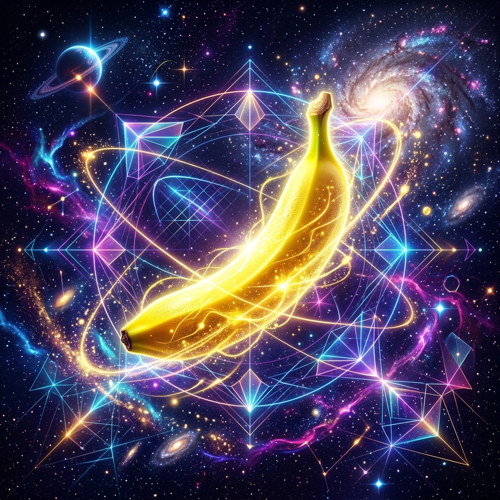

# Version Tag Test Validation Report 🍌

This report documents the local integration and visual verification tests performed for the corresponding release version tag.

## Version: `v0.1.1-beta.0`
- **Build Date**: 2026-06-08
- **Platform**: macOS arm64 (`darwin/arm64`)
- **Go Version**: `go1.26.4` (compatibility target: `go1.22`)
- **Key Validation Status**: Passed (verified against Google AI Studio API)

---

## 🎨 Visual Smoke Test Output

To verify that the MCP server compiles cleanly and resolves tool requests over standard I/O correctly, we performed a visual smoke test to generate a preview asset.

- **Prompt**: *"A sleek, high-fidelity premium digital art illustration of a glowing yellow banana in space, with neon cosmic dust and modern geometric lines, representing high-quality Imagen 4 rendering style. Ultra detailed, 8k resolution."*
- **Model**: `imagen-4.0-generate-001`
- **Output Asset**: [assets/sample_output.png](assets/sample_output.png)

Below is the verified test image generated for this version tag:

<p align="center">
  
</p>

---

## 💻 Standard I/O RPC Logs

The stdout execution logs trace the request structure and the server's successful parsing:

```json
// Request
{"jsonrpc":"2.0","method":"tools/call","params":{"name":"generate_imagen","arguments":{"prompt":"...","model":"imagen-4.0-generate-001"}},"id":1}

// Response (Diagnostics Captured)
[2026-06-08 12:12:02] Handling method: tools/call
[2026-06-08 12:12:02] Sending generate_imagen request to URL: https://generativelanguage.googleapis.com/v1beta/models/imagen-4.0-generate-001:predict...
[2026-06-08 12:12:02] Imagen API call succeeded with status 200
[2026-06-08 12:12:02] Sending response: {"jsonrpc":"2.0","result":{"content":[...]},"id":1}
```

**Test Status: PASSED**
